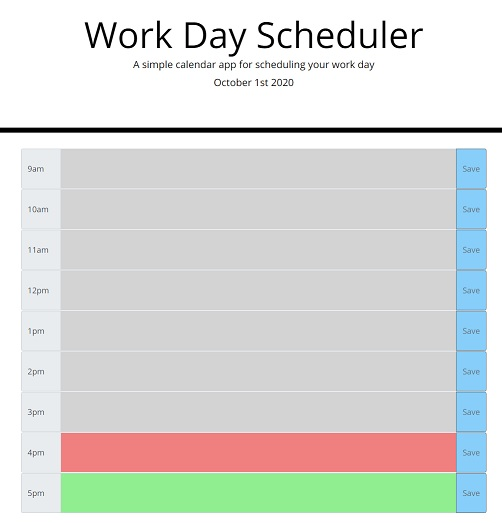

# Work Day Scheduler

This application helps us keep track of our day activities on business hours. It uses jquery to genarate most of the HTML and [Moment.js](https://momentjs.com/) for controlling the time.

Here is a link to the application: https://mariodiosdado.github.io/WorkDayScheduler/

## User Story

```
The application allows you to save your activity in localstorage, so even if the browser is refreshed the information is safe and it will show up again.
The current time of day is displayed with red, the previous hours are gray and the future hours are green.
```


Here is an example of the application when all hours are ahead of us.




